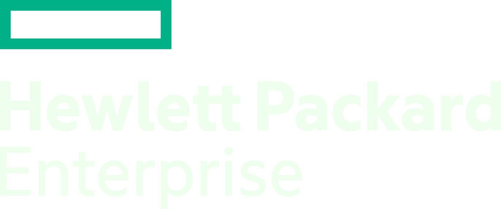

layout: false
class: center, middle, inverse

##Container Orchestration: Which Conductor?
[.green.bold[The Lab]]
###ContainerCon Europe, Berlin, Oct 2016
<h3>  &nbsp;&nbsp;&nbsp;&nbsp;  &nbsp;&nbsp; Haikel Guemar,  @hguemar </h3>
<h3>  &nbsp;&nbsp; &nbsp;&nbsp; &nbsp;&nbsp; Mike Bright,  @mjbright </h3>
<h3>  &nbsp;&nbsp; &nbsp;&nbsp; &nbsp;&nbsp; Mario Loriedo,  @mariolet </h3>

---
class: center, middle
.left-column[
## Lab
.footnote[.gray[ @hguemar @mjbright @mariolet ]]
]

.right-column[
## Agenda
We will look at each of
- Docker Swarm mode
- Kubernetes
- Apache Mesos

In less than 2 hours you won't become an expert but you will get good hands on experience.
]

---
.left-column[
## Lab
.footnote[.gray[ @hguemar @mjbright @mariolet ]]
]

.right-column[
## Pre-requisites for this lab:
https://github.com/mjbright/LinuxConEU-ContainerOrchestration/README.md#prereqs

This lab may be run either
- in HPE infrastructure
- locally on your own laptop
]

---
.left-column[
## Lab
.footnote[.gray[ @hguemar @mjbright @mariolet ]]
]

.right-column[
## Pre-requisites to run in the HPE infrastructure (recommended for this lab session)

To run in the HPE infrastructure you will need
- laptop
- OpenVPN client installed
    - https://openvpn.net/index.php/open-source/downloads.html

We will provide connection instructions on the day.
]

---
.left-column[
## Lab
.footnote[.gray[ @hguemar @mjbright @mariolet ]]
]

.right-column[
## Pre-requisites to run on your own laptop

To run on your own laptop you will need
- 8GBy RAM
- 20 GBy free disk space
- Vagrant
    - The provided Vagrantfile has been tested on CentOS 7 ad the libvirt provider
- Ansible 2.x

]

---
.left-column[
## Lab
.footnote[.gray[ @hguemar @mjbright @mariolet ]]
]

.right-column[
## Setup instructions to use the HPE Infrastructure
We will provide instructions on how to connect using OpenVPN on the day.

## Setup instructions to use your own laptop
Intructions are available here
https://github.com/mjbright/LinuxConEU-ContainerOrchestration/README.md#setup

Vagrant Box (to be provided - details at the above link)
]

---
.left-column[
## Lab
.footnote[.gray[ @hguemar @mjbright @mariolet ]]
]

.right-column[
## Lab instructions
https://github.com/mjbright/LinuxConEU-ContainerOrchestration/README.md#lab

- Detailed lab steps will be provided at the above link

]

---
name: last-page
class: center, middle, inverse

# Questions?
   

# Thank you
   

<h3>  &nbsp;&nbsp; &nbsp;&nbsp; &nbsp;&nbsp; thanks to HPE for lending their infrastructure @HPE </h3>
   

.gray[ [Slideshow created using [remark](http://github.com/gnab/remark). ]]

.footnote[.gray[ @hguemar @mjbright @mariolet ]]

