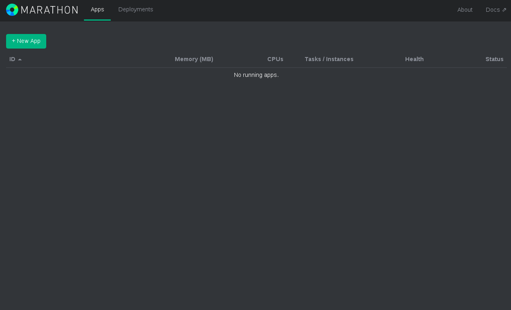
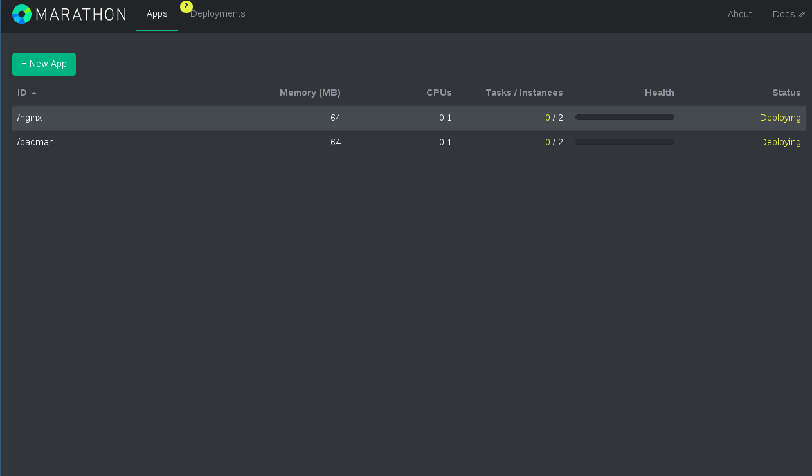

# Mesos Lab

First move to the source directory where you already downloaded the git repo sources:

git clone https://github.com/mjbright/LinuxConEU-ContainerOrchestration


```bash
pwd
```

    /home/group20/2016-Oct-31/LinuxConEU-ContainerOrchestration


## Setup the Mesos Master

We will now use docker-machine/virtualbox to create a new docker node to be used as the Mesos Master


```bash
docker-machine create --driver virtualbox mesosmaster
```

    Running pre-create checks...
    Creating machine...
    (mesosmaster) Copying /home/group20/.docker/machine/cache/boot2docker.iso to /home/group20/.docker/machine/machines/mesosmaster/boot2docker.iso...
    (mesosmaster) Creating VirtualBox VM...
    (mesosmaster) Creating SSH key...
    (mesosmaster) Starting the VM...
    (mesosmaster) Check network to re-create if needed...
    (mesosmaster) Waiting for an IP...
    Waiting for machine to be running, this may take a few minutes...
    Detecting operating system of created instance...
    Waiting for SSH to be available...
    Detecting the provisioner...
    Provisioning with boot2docker...
    Copying certs to the local machine directory...
    Copying certs to the remote machine...
    Setting Docker configuration on the remote daemon...
    Checking connection to Docker...
    Docker is up and running!
    To see how to connect your Docker Client to the Docker Engine running on this virtual machine, run: docker-machine env mesosmaster


```bash
docker-machine ls
```

    NAME          ACTIVE   DRIVER       STATE     URL                         SWARM   DOCKER    ERRORS
    mesosmaster   -        virtualbox   Running   tcp://192.168.99.100:2376           v1.12.3   


### Start the Mesos Master

We will now use docker-compose to start the Mesos Master as a container within the mesosmaster machine which we just created


```bash
docker-compose $(docker-machine config mesosmaster) -f mesos/master/docker-compose.yml up -d
```

    Pulling zk1 (jplock/zookeeper:3.4.6)...
    
    
    
    
    
    
    Pulling mesos1 (redjack/mesos-master:0.21.0)...
    
    
    
    
    
    
    
    
    
    Pulling marathon (mesosphere/marathon:v0.8.1)...
    
    
    
    
    
    
    
    
    
    
    
    
    Creating master_zk1_1
    Creating master_mesos1_1
    Creating master_marathon_1


## Access to the Marathon console from your laptop:

Let's get the ip address of our 'mesosmaster' machine, using
```bash
docker-machine ip mesosmaster
```


```bash
docker-machine ip mesosmaster
```

    192.168.99.109


So from a terminal on your laptop open the ssh tunnel to **YOUR USER@YOUR SERVER**

```bash
MYSERVER=10.3.222.33
MYUSER=group7
MESOSMASTER=192.168.99.109
```
e.g.
```bash
ssh group7@10.3.222.33 -L 8080:192.168.99.109:8080 -Nv
```


```bash
MYSERVER=10.3.222.33
MYUSER=group7
MESOSMASTER=192.168.99.107
ssh ${MYUSER}@${MYSERVER} -L 8080:${SWMASTERIP}:8080 -Nv
```

Then open your web browser at the page http://localhost:8080 and you should see the Marathon console, as shown here



### Setup the Mesos Slaves

We will now use docker-machine/virtualbox to create new docker nodes to be used as the Mesos Slaves.


```bash
docker-machine create --driver virtualbox mesosslave1
```

    Running pre-create checks...
    Creating machine...
    (mesosslave1) Copying /home/group20/.docker/machine/cache/boot2docker.iso to /home/group20/.docker/machine/machines/mesosslave1/boot2docker.iso...
    (mesosslave1) Creating VirtualBox VM...
    (mesosslave1) Creating SSH key...
    (mesosslave1) Starting the VM...
    (mesosslave1) Check network to re-create if needed...
    (mesosslave1) Waiting for an IP...
    Waiting for machine to be running, this may take a few minutes...
    Detecting operating system of created instance...
    Waiting for SSH to be available...
    Detecting the provisioner...
    Provisioning with boot2docker...
    Copying certs to the local machine directory...
    Copying certs to the remote machine...
    Setting Docker configuration on the remote daemon...
    Checking connection to Docker...
    Docker is up and running!
    To see how to connect your Docker Client to the Docker Engine running on this virtual machine, run: docker-machine env mesosslave1


```bash
docker-machine create --driver virtualbox mesosslave2
```

    Running pre-create checks...
    Creating machine...
    (mesosslave2) Copying /home/group20/.docker/machine/cache/boot2docker.iso to /home/group20/.docker/machine/machines/mesosslave2/boot2docker.iso...
    (mesosslave2) Creating VirtualBox VM...
    (mesosslave2) Creating SSH key...
    (mesosslave2) Starting the VM...
    (mesosslave2) Check network to re-create if needed...
    (mesosslave2) Waiting for an IP...
    Waiting for machine to be running, this may take a few minutes...
    Detecting operating system of created instance...
    Waiting for SSH to be available...
    Detecting the provisioner...
    Provisioning with boot2docker...
    Copying certs to the local machine directory...
    Copying certs to the remote machine...
    Setting Docker configuration on the remote daemon...
    Checking connection to Docker...
    Docker is up and running!
    To see how to connect your Docker Client to the Docker Engine running on this virtual machine, run: docker-machine env mesosslave2


```bash
docker-machine ls
```

    NAME          ACTIVE   DRIVER       STATE     URL                         SWARM   DOCKER    ERRORS
    mesosmaster   -        virtualbox   Running   tcp://192.168.99.109:2376           v1.12.3   
    mesosslave1   -        virtualbox   Running   tcp://192.168.99.113:2376           v1.12.3   
    mesosslave2   -        virtualbox   Running   tcp://192.168.99.112:2376           v1.12.3   


### Start the Mesos Slaves

We will now use docker-compose to start the Mesos Slaves as container within the mesosslave machines which we just created


```bash
docker-compose $(docker-machine config mesosslave1) -f mesos/slave/docker-compose.yml up -d
```

    Pulling slave (redjack/mesos-slave:0.21.0)...
    
    
    
    
    
    
    
    
    
    
    Creating slave_slave_1


```bash
docker-compose $(docker-machine config mesosslave2) -f mesos/slave/docker-compose.yml up -d
```

    Pulling slave (redjack/mesos-slave:0.21.0)...
    
    
    
    
    
    
    
    
    
    
    Creating slave_slave_1


### Deploy applications on to the Mesos cluster

Use the Marathon application descriptions nginx.json and pacman.json to deploy these apps on mesos/marathon

Let's first obtain the ip address of our Mesos Master node:


```bash
MESOS_MASTERIP=$(docker-machine ip mesosmaster)
echo $MESOS_MASTERIP
```

    192.168.99.109


Now let's launch the nginx application, by sending a POST request to the Mesos Master:


```bash
curl -X POST -H "Accept: application/json" -H "Content-Type: application/json" http://$MESOS_MASTERIP:8080/v2/apps -d @mesos/nginx.json
```

    {"id":"/nginx","cmd":null,"args":null,"user":null,"env":{},"instances":2,"cpus":0.1,"mem":64.0,"disk":0.0,"executor":"","constraints":[],"uris":[],"storeUrls":[],"ports":[0],"requirePorts":false,"backoffFactor":1.15,"container":{"type":"DOCKER","volumes":[],"docker":{"image":"nginx","network":"BRIDGE","portMappings":[{"containerPort":80,"hostPort":0,"servicePort":0,"protocol":"tcp"}],"privileged":false,"parameters":[]}},"healthChecks":[{"path":"/","protocol":"HTTP","portIndex":0,"command":null,"gracePeriodSeconds":5,"intervalSeconds":20,"timeoutSeconds":20,"maxConsecutiveFailures":3}],"dependencies":[],"upgradeStrategy":{"minimumHealthCapacity":1.0,"maximumOverCapacity":1.0},"labels":{},"version":"2016-10-31T14:20:15.971Z","tasks":[],"deployments":[{"id":"b6fb2a4f-9e78-4aa8-9ce8-969257799260"}],"tasksStaged":0,"tasksRunning":0,"tasksHealthy":0,"tasksUnhealthy":0,"backoffSeconds":1,"maxLaunchDelaySeconds":3600}

and let's launch the pacman application, by sending a POST request to the Mesos Master:


```bash
curl -X POST -H "Accept: application/json" -H "Content-Type: application/json" http://$MESOS_MASTERIP:8080/v2/apps -d @mesos/pacman.json
```

    {"id":"/pacman","cmd":null,"args":null,"user":null,"env":{},"instances":2,"cpus":0.1,"mem":64.0,"disk":0.0,"executor":"","constraints":[],"uris":[],"storeUrls":[],"ports":[0],"requirePorts":false,"backoffFactor":1.15,"container":{"type":"DOCKER","volumes":[],"docker":{"image":"emilevauge/pacman","network":"BRIDGE","portMappings":[{"containerPort":80,"hostPort":0,"servicePort":0,"protocol":"tcp"}],"privileged":false,"parameters":[]}},"healthChecks":[],"dependencies":[],"upgradeStrategy":{"minimumHealthCapacity":1.0,"maximumOverCapacity":1.0},"labels":{},"version":"2016-10-31T14:20:58.165Z","tasks":[],"deployments":[{"id":"bf88d1a4-ed34-4e29-92f0-c5b0e35f0f13"}],"tasksStaged":0,"tasksRunning":0,"tasksHealthy":0,"tasksUnhealthy":0,"backoffSeconds":1,"maxLaunchDelaySeconds":3600}

The Marathon console, at http://localhost:8080, should now show these 2 services to be running:



Play with the Marathon console: scale applications, kill them etc...


```bash

```
