<font size=+5 >
# Docker "Swarm Mode" Lab - play-with-docker.com version

Based on Mario's gist here: https://gist.github.com/l0rd/5186cc80f8f26dc7e9490abca4405830

In this version of the lab we will use the <a href="http://play-with-docker.com/" > http://play-with-docker.com/</a> infrastructure to run the lab.

# Requirements
- Web browser

# Connect to play-with-docker

Connect using the link <a href="http://play-with-docker.com/" > http://play-with-docker.com/</a>.

If you are not a robot click the captcha button - go on I trust you ;-)

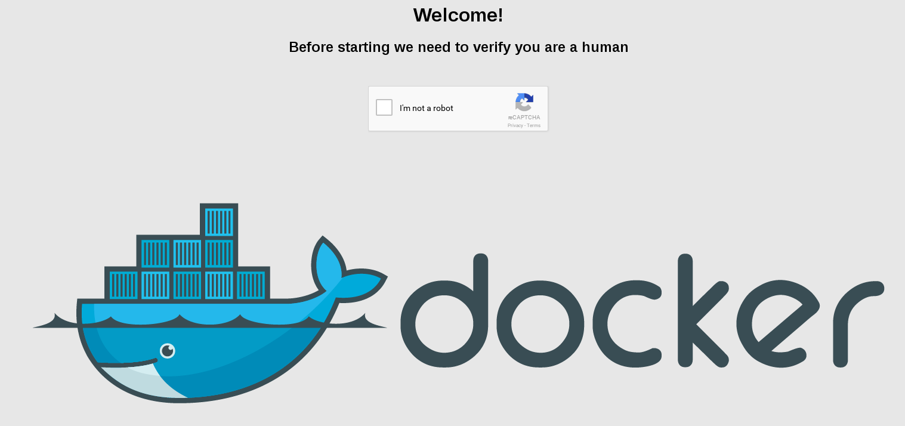 <br/>

# Create 5 nodes for your swarm cluster
(5 nodes is the play-with-docker maximum)

Later we will set them up to be 3 masters and 2 slaves.

Click on the "ADD NEW INSTANCE" link on the left pane, then you should see your instance listed on the left and it's console displayed on the right as in this image:
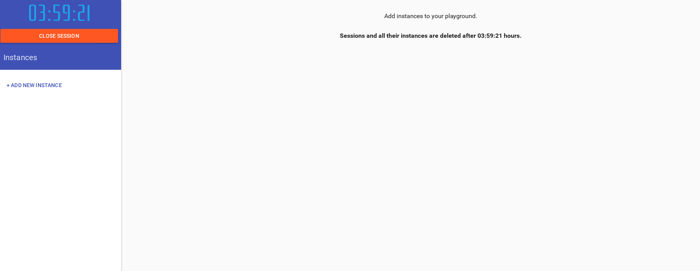 <br/>

Note that up top is displayed the current node name and it's ip address.
<br/>
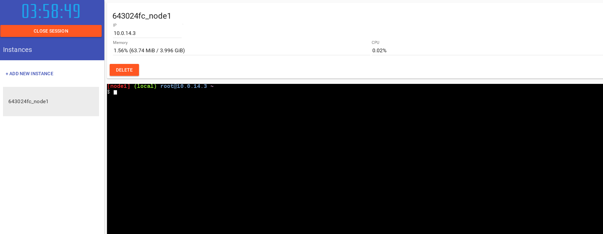 <br/>

As reproduced here:
<br/>
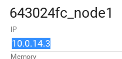 <br/>

Now go ahead and create 4 more instances as shown here:
<br/>
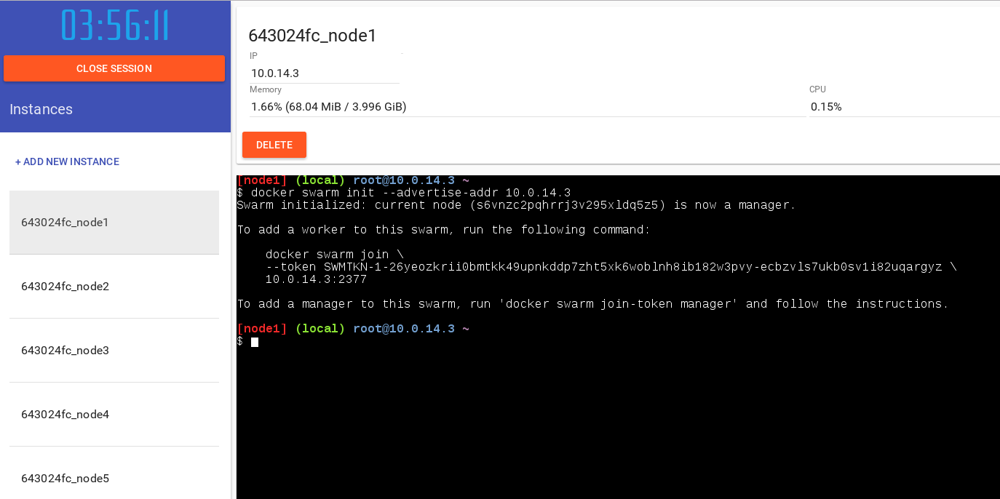 <br/>


# Initialize our swarm cluster

Now that we have 5 nodes available, we will initialize our Swarm Cluster with 3 master nodes.

### Networks before creation of swarm cluster
Before going further let's look at the networks on your machine.

Later, we'll see how a new network is created once the swarm cluster has been created.


    NETWORK ID          NAME                DRIVER              SCOPE
    c7c01d8b70a3        bridge              bridge              local
    e16375837cfa        host                host                local
    f22f49175ae7        none                null                local


## Initialize the cluster from node1

Use the ip address of your node1 in the command below:
<br/>
```
    docker swarm init --advertise-addr 10.0.14.3
```
<br/>
<br/>
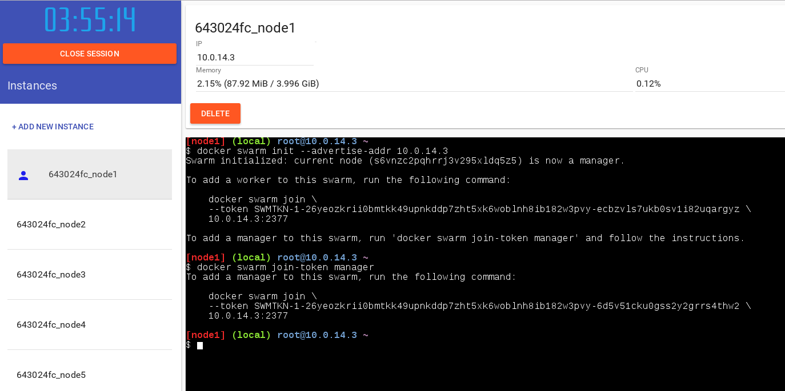 <br/>

The above command provides us with the command which we can run on other nodes to allow them to join
the cluster as a worker node.

We can obtain this information from a management node (only node1 so far) by the following command:
<br/>
```
    docker swarm join-token worker
```

Similarly we can obtain the command to add a new Master node (only node1 so far) by the following command:
<br/>
<br/>
```
    docker swarm join-token master
```
<br/>
<br/>
Now run the provided
<br/>
<br/>
```
    docker swarm join --token TOKEN IP:PORT
```
<br/>
<br/>
 command on node2.
<br/>

Note that now both node1 and node2 have a special blue symbol indicating that they are Swarm Master nodes:
<br/>
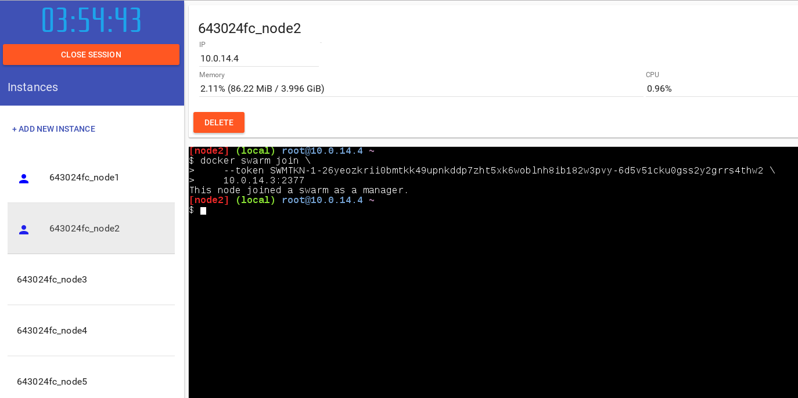 <br/>

<br/>
Now run the same provided
<br/>
<br/>
```
    docker swarm join --token TOKEN IP:PORT
```
<br/>
<br/>
 command on node3, which will also then have the blue symbol.

<br/>
<br/>
 <br/>

Now that node3 is also a Master node we can obtain the command to add new Worker nodes
using the command
<br/>
<br/>
```
    docker swarm join-token worker
```
<br/>
<br/>
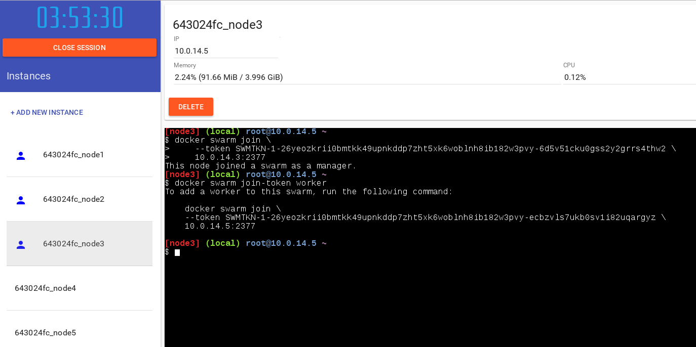 <br/>

<br/>
<br/>
Now use this command to add node4 as a Worker node:

<br/>
<br/>
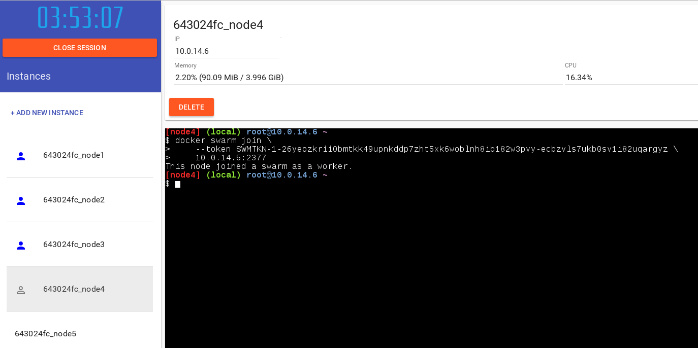 <br/>

... and node5 as a Worker node:

<br/>
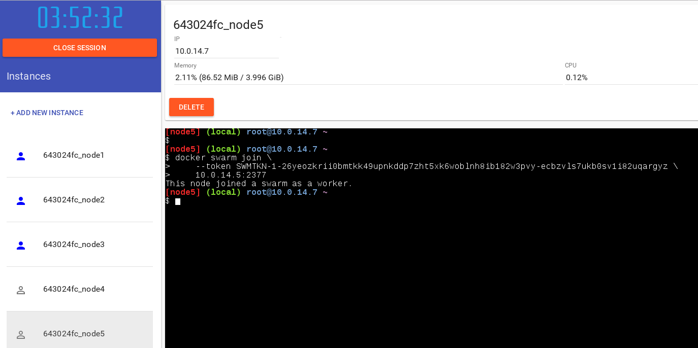 <br/>

Note in the above image that we now have grey symbols to depict that node4 and node5 have now
joined the cluster as Worker nodes.

<br/>
<br/>
A docker info should now show
<pre>
Swarm: active
Managers: 3
Nodes: 5
</pre>
<br/>
as below:
<br/>
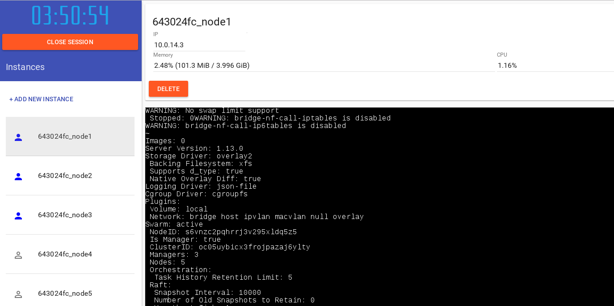 <br/>
<br/>
<br/>

```
docker network ls
```
<br/> <br/>

If we look at the networks we should now see new networks such as '*ingress*' an overlay network and docker_gwbridge for the swarm cluster.

<br/> <br/>
<pre>
    NETWORK ID          NAME                DRIVER              SCOPE
    c7c01d8b70a3        bridge              bridge              local
    32597262f84d        docker_gwbridge     bridge              local
    e16375837cfa        host                host                local
    cysk2wkjtjca        ingress             overlay             swarm
    f22f49175ae7        none                null                local
</pre>


<br/>
<br/>
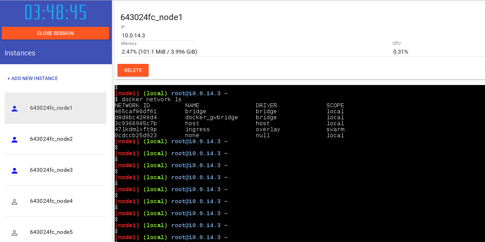 <br/>

# start service

First we check for any running services - there should be none in our newly initialized cluster:


```
docker service ls
```

<pre>
    ID  NAME  MODE  REPLICAS  IMAGE
</pre>

<br/>
Now we will create a new service based on the docker image mariolet/docker-demo

<br/>
We will expose this service on port 8080

```
docker service create --replicas 1 --name docker-demo -p 8080:8080 mariolet/docker-demo:20
```

Now we list services again and we should see our newly added docker-demo service

<br/> <br/>
```
docker service ls
```
<br/> <br/>


<br/>
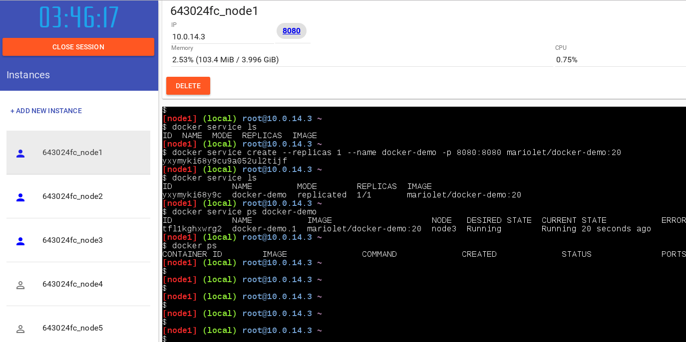 <br/>
<br/> <br/>

In the above example we see that we have launched just one instance of our service and that it is running on node3.

So changing to node3 (in left hand bar) we can check this with a simple
<br/> <br/>
```
        docker ps
```
<br/> <br/>
on node3 console.

<br/> <br/>
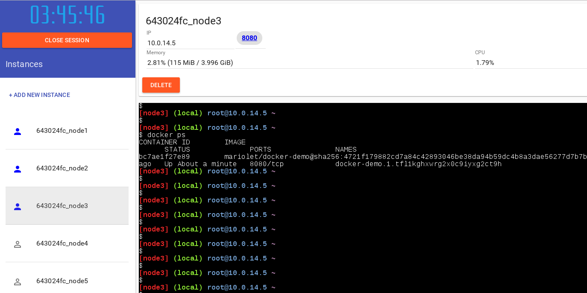 <br/>


    ID            NAME         MODE        REPLICAS  IMAGE
    z6yi30k1yqed  docker-demo  replicated  0/1       mariolet/docker-demo:20


... and we can look at the service as seen by the cluster using:
<br/> <br/>
```
docker service ps docker-demo
```
<br/> <br/>
<pre>
    ID            NAME           IMAGE                    NODE     DESIRED STATE  CURRENT STATE            ERROR  PORTS
    sac0v5i5beuj  docker-demo.1  mariolet/docker-demo:20  swnode2  Running        Preparing 4 seconds ago         
</pre>

Note that since we created our service we now have a link to the exposed port <b>8080</b> at the top of the page.

<br/>
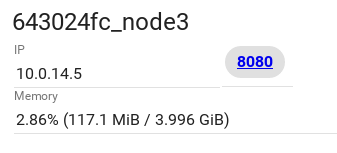 <br/>
<br/> <br/>
Clicking on that link will take you to the service web page:
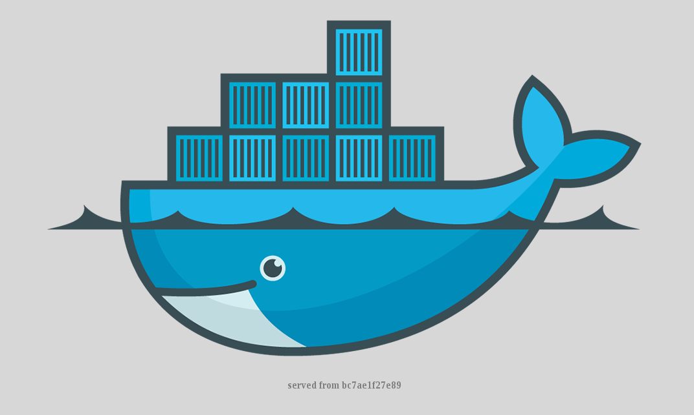 <br/>
<br/> <br/>

# Scaling our service

Now we can scale the service to 5 replicas using the command:

<br/> <br/>
```
docker service scale docker-demo=5
```
<br/> <br/>
```
docker service ps docker-demo
```

<br/> <br/>

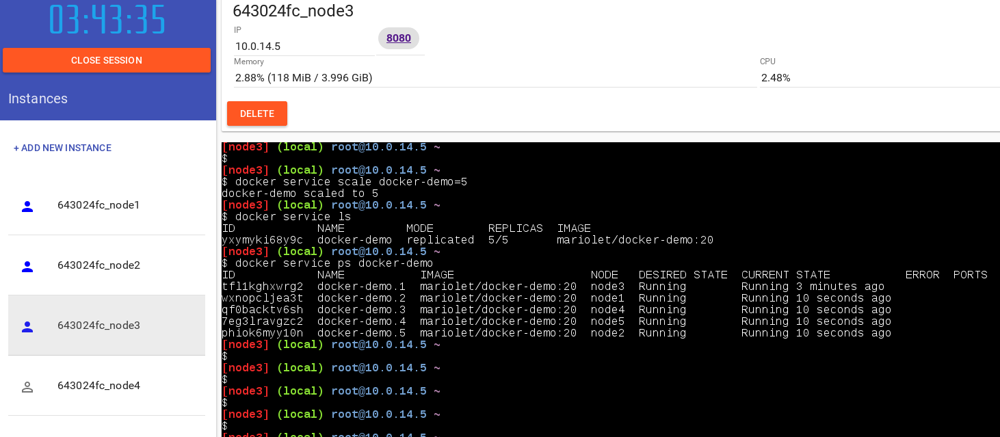 <br/>
<br/> <br/>

# Perform a 'Rolling Update" of our service to a new version

Now we will see how we can perform a rolling update.

<br/> <br/>
We initially deployed version 20 of the service, now we will upgrade our whole cluster to version 20 

<br/>
```
docker service update --image mariolet/docker-demo:21 docker-demo
```
<br/>
<br/>
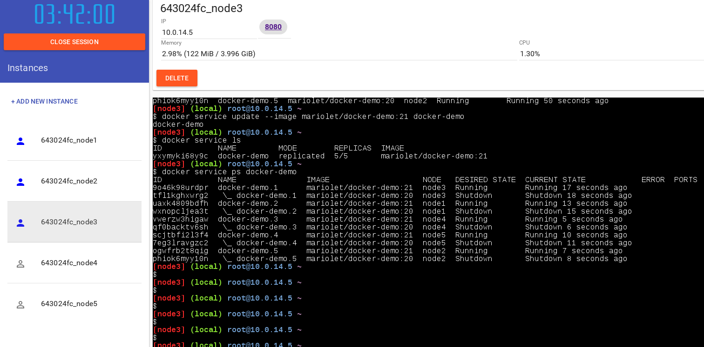 <br/>
<br/> <br/>

And visiting the demo page (via the <b>8080</b> link again we see visibly that our service has been updated !!

<br/> <br/>
<b>Red Whales Batman!</b>

<br/>
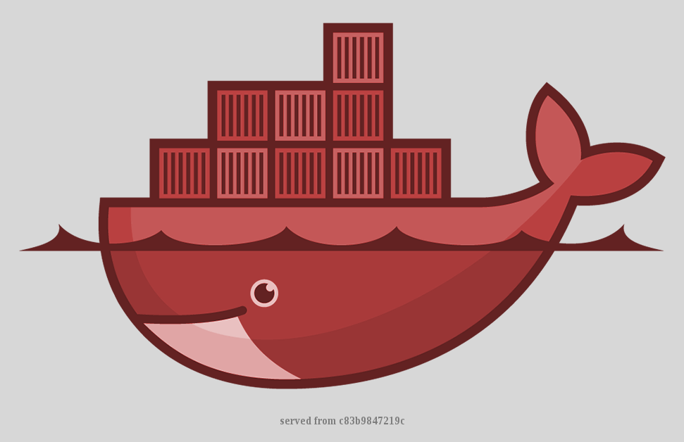 <br/>
<br/> <br/>

Performing a '*service ps*' command on our docker-demo we see evidence that the instances have been updated from
version 20 to version 21:

```
docker service ps docker-demo
```
# Draining a Node

We can drain a node so as to place it in 'maintenance mode'.

Draining a node means that it no longer has running tasks on it so that it can be taken off line
without affecting running services.

<br/> <br/>
Let's see what nodes are running using
<br/> <br/>
```
docker node ls
```

Let's drain a node:

```
docker node update --availability drain node2
```

<br/>
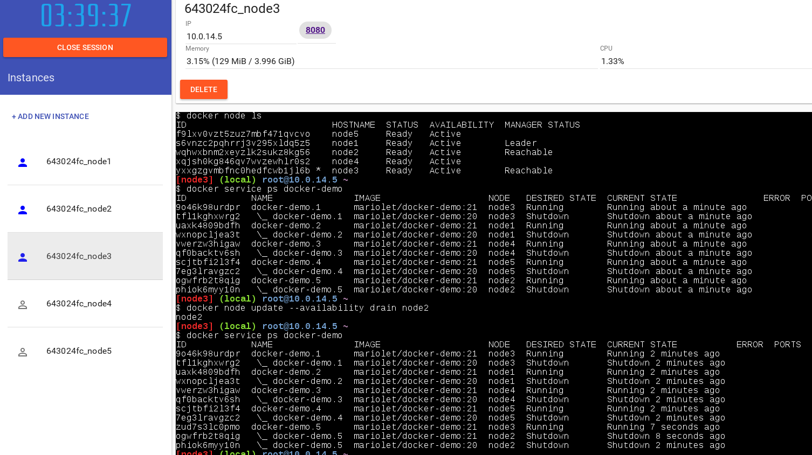 <br/>
<br/> <br/>

# Remove a service - cleanup

Now let's cleanup by removing our service


```
docker service rm docker-demo
```


We can check that the service is no longer running:


```
docker service ps docker-demo
```

<br/>
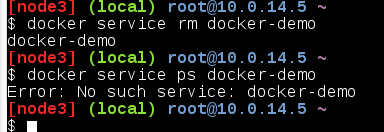 <br/>


</font>

