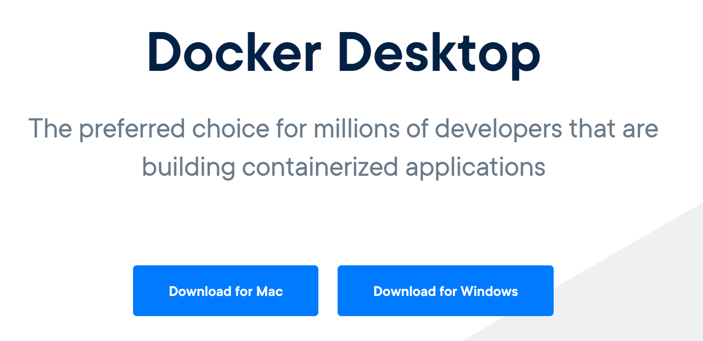
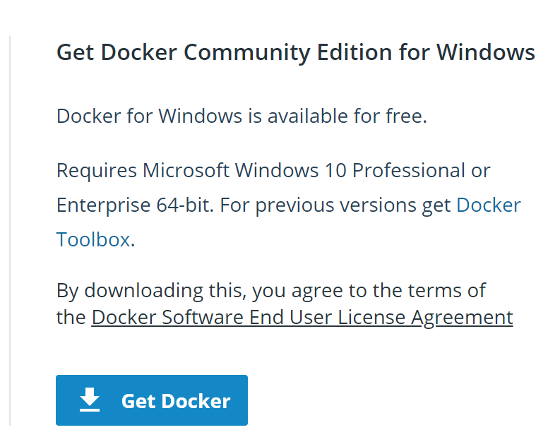
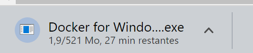
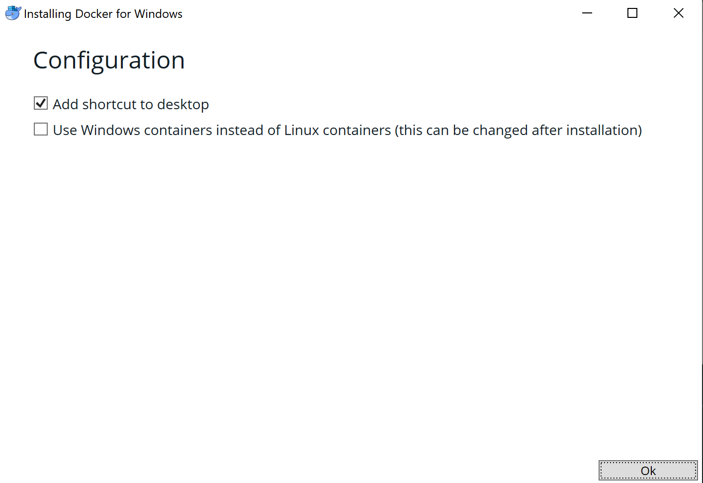
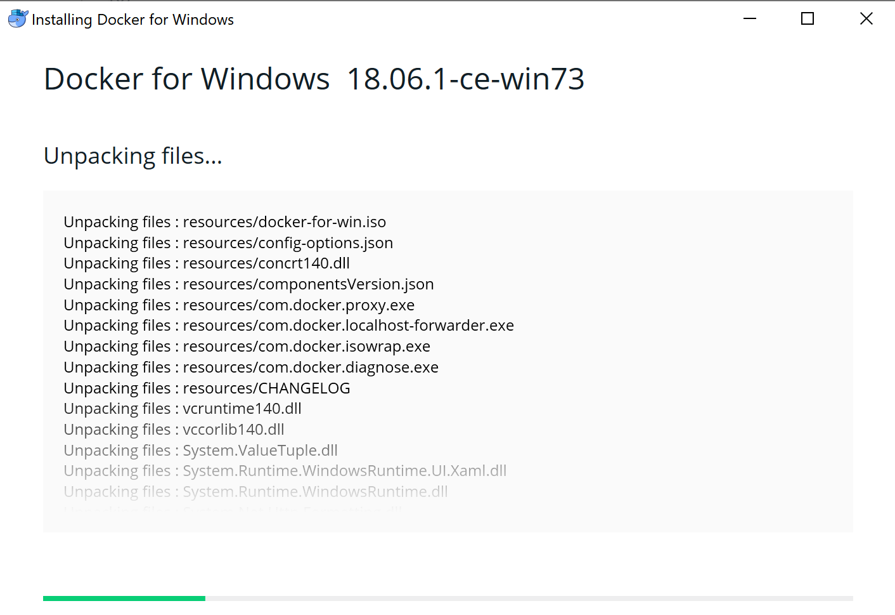
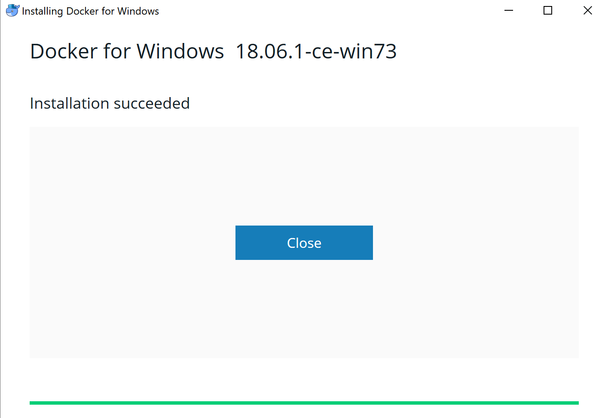
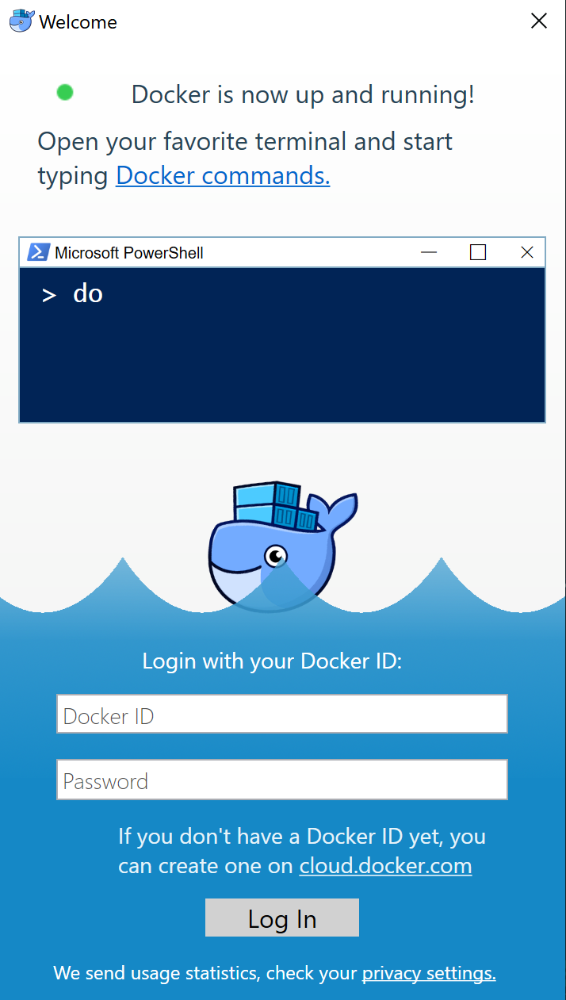
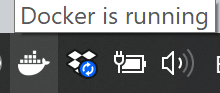
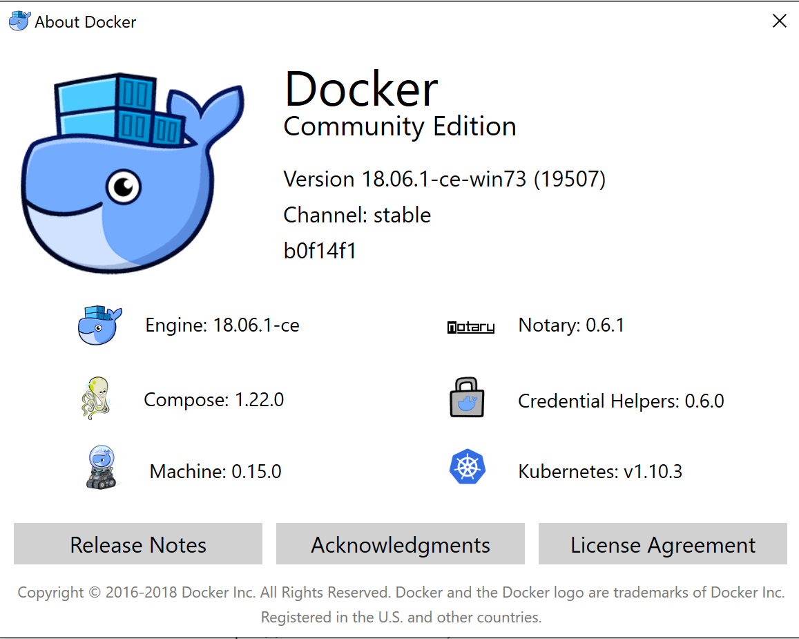

# Docker Installation

In this section we'll look at installing Docker either on
- [CentOS](#install_d_centos) using the Docker provided yum repo
- [Windows10](#install_dd_windows) using the Docker Desktop application

And then we'll run a quick [#example](#example) to test our installation.

<div id="install_d_centos">

# On CentOS

We will look at installing the latest stable Docker Community Edition version on CentOS 7.x.

#### Uninstalling Docker

If you need to uninstall an existing Docker distribution, for example of older CentOS provided packages, you will first need to do the following:

```sh
sudo yum remove docker docker-client docker-client-latest docker-common docker-latest \
                docker-latest-logrotate docker-logrotate docker-selinux docker-engine-selinux docker-engine
```

You may want to check that no Docker processes are running now:
```sh
ps -fade | grep docker | grep -v grep
```

## Installing Docker on CentOS 7.x

Let's first update the list of packages available on our system:
```sh
sudo yum update
sudo yum upgrade
```

Then install some necessary packages, and the Docker provided repo:
```sh
sudo yum install -y yum-utils device-mapper-persistent-data lvm2
sudo yum-config-manager -- add-repo https://download.docker.com/linux/centos/docker-ce.repo
```
We can now install Docker itself:`
```sh
sudo yum install docker-ce
```

## Starting and checking Docker

We can now start Docker on our system
```sh
sudo systemctl start docker
```

and check that it's running.

The command
```sh
sudo docker version
```
should show the version of both the docker command-line client and the docker daemon, something like:
```
Client:
 Version:           18.06.1-ce
 API version:       1.38
 Go version:        go1.10.3
 Git commit:        e68fc7a
 Built:             Tue Aug 21 17:24:51 2018
 OS/Arch:           linux/amd64
 Experimental:      false

Server:
 Engine:
  Version:          18.06.1-ce
  API version:      1.38 (minimum version 1.12)
  Go version:       go1.10.3
  Git commit:       e68fc7a
  Built:            Tue Aug 21 17:23:15 2018
  OS/Arch:          linux/amd64
  Experimental:     false
  ```

### Allowing a non-root user to run Docker commands

Let's create a docker group if it doesn't exist already:
```sh
sudo groupadd docker
```

Add your current user "$USER" to the docker group.

Change the user name to match your preferred user if you do not want to use your current user:
```sh
sudo gpasswd -a $USER docker
```

Now logout and login again for the changes to take effect, or:
```sh
newgrp docker
```

Now check that your non-root user can run Docker commands:
```sh
docker version
```

Now skip to the [#example](#example) below to run a few simple Docker commands

<div id="install_dd_windows">

# On Docker Desktop for Windows

## Download Docker Desktop for Windows

Download from https://www.docker.com/products/docker-desktop


Click on the "Download for Windows" button.



On the following page, click on the "Get Docker" button.



Once downloaded click on the "Docker for Windows Installer.exe" executable which you downloaded.



Choose the defaults



The installation takes 1 or 2 minutes




Once installed, select Docker and double-click to start


You should now see the Docker icon, animated, in the task bar as it starts up.



Once started you will be invited to enter your DockerID

(If you don't have one, create one for free on https://cloud.docker.com)



Now that Docker is running, right-click on the Docker icon and select 'About Docker' to see what has been installed.



For the moment we are interested in the Docker Engine only, but we will see some of the other components later.


<div id="example">

# Performing some basic Docker commands

Let's check that we can search for images available
```sh
docker search hello-world
```

and you should see a list of available image matching "hello-world" as below:
```
NAME                                       DESCRIPTION                                     STARS               OFFICIAL            AUTOMATED
hello-world                                Hello World! (an example of minimal Dockeriz…   689                 [OK]
kitematic/hello-world-nginx                A light-weight nginx container that demonstr…   111
tutum/hello-world                          Image to test docker deployments. Has Apache…   56                                      [OK]
dockercloud/hello-world                    Hello World!                                    14                                      [OK]
....
```
We will look at this in more detail later.


For now let's run the hello-world image:
```sh
docker run hello-world
```

and you should see output similar to:
```
Unable to find image 'hello-world:latest' locally
latest: Pulling from library/hello-world
d1725b59e92d: Pull complete
Digest: sha256:0add3ace90ecb4adbf7777e9aacf18357296e799f81cabc9fde470971e499788
Status: Downloaded newer image for hello-world:latest

Hello from Docker!
This message shows that your installation appears to be working correctly.

To generate this message, Docker took the following steps:
 1. The Docker client contacted the Docker daemon.
 2. The Docker daemon pulled the "hello-world" image from the Docker Hub.
    (amd64)
 3. The Docker daemon created a new container from that image which runs the
    executable that produces the output you are currently reading.
 4. The Docker daemon streamed that output to the Docker client, which sent it
    to your terminal.

To try something more ambitious, you can run an Ubuntu container with:
 $ docker run -it ubuntu bash

Share images, automate workflows, and more with a free Docker ID:
 https://hub.docker.com/

For more examples and ideas, visit:
 https://docs.docker.com/get-started/
```

Not an amazing demo, but then we did just pull some code across half the world to execute on our machine ... not bad !

We'll look at this in more detail later.
