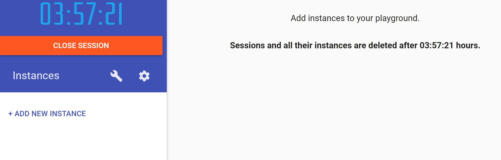

# TP7: Docker Compose

You can find the official documentation for '*Docker Compose*' here: [https://docs.docker.com/compose/](https://docs.docker.com/compose/)

The source code for '*Docker Compose*' is available here: [https://github.com/docker/compose](https://github.com/docker/compose)

## 1. Connect to the Play-with-Docker environment

For this lab I propose to use a new environment, an environment in the cloud called "Play with Docker".

Open a browser window at https://play-with-docker.com.

Connect to your account.

Once logged in you will see that our environment is available for 4 hours, we see the countdown timer.
So beware that all work you do here will be lost.

Click on the **"+ ADD NEW INSTANCE"** button


This will create a new Docker host for us.

From this host verify that you can run some commands:
```
docker version
docker container run --rm hello-world
docker image ls
```

**All commands in this page should be typed into the terminal of play-with-docker.**

## 2. Download docker-compose

In fact we do not need to do this as the latest docker-compose is already installed in this environment.

## 2.1 Download docker-compose bash-completion

```bash
sudo curl -L https://raw.githubusercontent.com/docker/compose/1.22.0/contrib/completion/bash/docker-compose -o /etc/bash_completion.d/docker-compose
```

Now enable the bash completion and test that it works:
```
. /etc/bash_completion.d/docker-compose
```

Test by typing:
```
docker-compose v<TAB>
```

The command should auto-complete to
```
docker-compose version
```

## 3. Using docker-compose

To see what version you have installed
```
docker-machine compose
```

you should see something similar to:
```
$ docker-compose version
docker-compose version 1.23.0-rc3, build ea3d406e
docker-py version: 3.5.0
CPython version: 3.6.6
OpenSSL version: OpenSSL 1.1.0f  25 May 2017
```


## 4 Recuperate the example voting app

For this lab I propose to use a new environment, an environment in the cloud called "Play with Docker"
```
git clone https://github.com/dockersamples/example-voting-app
```
