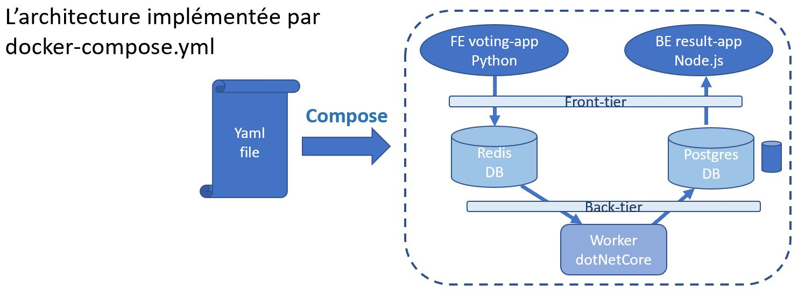
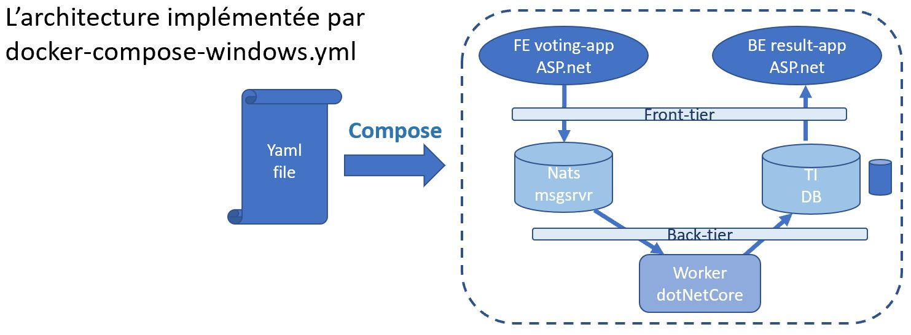

# TP8: Docker Swarm

We will now use Docker 'Swarm Mode' to manage a cluster of nodes.

Note that this time we have nothing extra to install, 'Swarm Mode' capabilities are integrated into the
standard Docker Engine.

We will use Play with Docker again.

# 1. Create multiple nodes

Create 3 nodes in play-with-docker by pressing on the **"+ ADD NEW INSTANCE"** link.


# 2. Create a Swarm Cluster

# 2.1 Initialize the 1st node as the Swarm Master

Use the command ```docker swarm init``` to initialize the cluster.
Probably you will get an error, if so run ```docker swarm init --advertise-addr $(hostname -i)``` to use the first network.

```
[node1] (local) root@192.168.0.48 ~
$ docker swarm init
Error response from daemon: could not choose an IP address to advertise since this system has multiple addresses on different interfaces (192.168.0.48 on eth0 and 172.18.0.25 on eth1) - specify one with --advertise-addr
[node1] (local) root@192.168.0.48 ~
$ docker swarm init --advertise-addr $(hostname -i)
Swarm initialized: current node (ykzexnk780yh6ivpokyg2919a) is now a manager.

To add a worker to this swarm, run the following command:

    docker swarm join --token SWMTKN-1-1skoem28av2k2scj5nivccywjydioj7y7b2vr88rypdhy3e6fh-4zdyb2lkln490rqcmaz42gi2o 192.168.0.48:2377

To add a manager to this swarm, run 'docker swarm join-token manager' and follow the instructions.
```

The swarm has been initialized and node1 is our Master, check using ```docker node ls``` as below:
```
[node1] (local) root@192.168.0.48 ~
$ docker node ls
ID                            HOSTNAME            STATUS              AVAILABILITY        MANAGER STATUS      ENGINE VERSION
ykzexnk780yh6ivpokyg2919a *   node1               Ready               Active              Leader              18.06.1-ce
```

## 2.2 On this 1st node, obtain the join token

Note that we have been provided with the command to run on *another node* to allow this node to join the cluster as a worker node.

If you didn't capture that command, you can obtain it again with the ```docker swarm join-token``` command with either manager or worker as argument, e.g. to get the command to join a node as a worker:
```
[node1] (local) root@192.168.0.48 ~
$ docker swarm join-token worker
To add a worker to this swarm, run the following command:

    docker swarm join --token SWMTKN-1-1skoem28av2k2scj5nivccywjydioj7y7b2vr88rypdhy3e6fh-4zdyb2lkln490rqcmaz42gi2o 192.168.0.48:2377
```

**NOTE:** We can also obtain just the token rather than the full command with ```docker swarm join-token worker -q```
```
[node1] (local) root@192.168.0.48 ~
$ docker swarm join-token worker -q
SWMTKN-1-1skoem28av2k2scj5nivccywjydioj7y7b2vr88rypdhy3e6fh-4zdyb2lkln490rqcmaz42gi2o
```

## 2.3 Join node2 to the cluster as a worker

Run the ```docker swarm join``` command you were provided with by the ```docker swarm join-token worker``` command above.

e.g.
```
[node2] (local) root@192.168.0.47 ~
$ docker swarm join --token SWMTKN-1-1skoem28av2k2scj5nivccywjydioj7y7b2vr88rypdhy3e6fh-4zdyb2lkln490rqcmaz42gi2o 192.168.0.48:2377
This node joined a swarm as a worker.
```

## 2.4 Join node3 to the cluster as a worker

Perform the same ```docker swarm join``` command as for node2.
e.g.
```
[node3] (local) root@192.168.0.46 ~
$ docker swarm join --token SWMTKN-1-1skoem28av2k2scj5nivccywjydioj7y7b2vr88rypdhy3e6fh-4zdyb2lkln490rqcmaz42gi2o 192.168.0.48:2377
This node joined a swarm as a worker.
```

## 2.5 Check that we now have 3 nodes in our cluster

**NOTE:** This command must be run from a master node, i.e. node1 in our case:
```
[node1] (local) root@192.168.0.48 ~
$ docker node ls
ID                            HOSTNAME            STATUS              AVAILABILITY        MANAGER STATUS      ENGINE VERSION
ykzexnk780yh6ivpokyg2919a *   node1               Ready               Active              Leader              18.06.1-ce
qsri0p2teyxcyo1jcgrdx1u06     node2               Ready               Active                                  18.06.1-ce
x1yt1bs5movv21cdnak6w2sxv     node3               Ready               Active                                  18.06.1-ce
```

## 2.6 Using docker stack deploy

The command ```docker stack deploy```, equivalent to ```docker-compose up``` is used to create a stack of services from
a Docker-compose file (version3).

```
[node1] (local) root@192.168.0.48 ~
$ docker stack deploy --help

Usage:  docker stack deploy [OPTIONS] STACK

Deploy a new stack or update an existing stack

Options:
      --bundle-file string     Path to a Distributed Application Bundle file
  -c, --compose-file strings   Path to a Compose file, or "-" to read from stdin
      --namespace string       Kubernetes namespace to use
      --prune                  Prune services that are no longer referenced
      --resolve-image string   Query the registry to resolve image digest and
                               supported platforms ("always"|"changed"|"never")
                               (default "always")
      --with-registry-auth     Send registry authentication details to Swarm agents
```


# 3. Deploy the example-voting-app to the cluster

## 3.1 Recuperate the example voting app

Get the source code from the github repo (same as for docker-compose):
```
mkdir ~/src
cd    ~/src
git clone https://github.com/dockersamples/example-voting-app
```

Go to the directory where you downloaded the source for the voting-app and list the YAML (\*.yml) files there
```
cd example-voting-app
ls *.yml
```

e.g.
```
[node1] (local) root@192.168.0.22 ~/src/example-voting-app
$ ls -al *.yml
-rw-r--r--    1 root     root           808 Nov  9 07:34 docker-compose-javaworker.yml
-rw-r--r--    1 root     root           517 Nov  9 07:34 docker-compose-k8s.yml
-rw-r--r--    1 root     root           400 Nov  9 07:34 docker-compose-simple.yml
-rw-r--r--    1 root     root          1107 Nov  9 07:34 docker-compose-windows-1809.yml
-rw-r--r--    1 root     root           994 Nov  9 07:34 docker-compose-windows.yml
-rw-r--r--    1 root     root           808 Nov  9 07:34 docker-compose.yml
-rw-r--r--    1 root     root          1435 Nov  9 07:34 docker-stack-simple.yml
-rw-r--r--    1 root     root          1037 Nov  9 07:34 docker-stack-windows-1809.yml
-rw-r--r--    1 root     root          1284 Nov  9 07:34 docker-stack-windows.yml
-rw-r--r--    1 root     root          1666 Nov  9 07:34 docker-stack.yml
-rw-r--r--    1 root     root          3201 Nov  9 07:34 kube-deployment.yml
```

We see that there are several docker stack files.

For this lab we are interested in:
- docker-stack-simple.yml
- docker-stack.yml
- docker-stack-windows.yml

#### 3.1.1 Docker-stack-simple

This is the simplest architecture proposed.

We have a micro-service implementation of a voting application with 5 elements.

In the diagram we can see that there are 2 front-end applications
- the voting 


Examine the file docker-stack-simple.yml to see what services are present and how they are configured.

Now launch the application (in detached mode) with
```
[node1] (local) root@192.168.0.48 ~/src/example-voting-app
$ docker stack deploy -c docker-stack-simple.yml vote
Creating network vote_frontend
Creating service vote_backend
Creating service vote_redis
Creating service vote_db
Creating service vote_vote
Creating service vote_result
```

You should now see some links appear at the top of the Play-with-docker page allowing access to the voting app (port 5000) and the results app (port 5001).

Click on them to try the app.

____


You can check the logs of all running services with
```
docker-compose -f docker-compose-simple.yml logs
```

Or a specific service, such as vote here:
```
docker-compose -f docker-compose-simple.yml logs vote
```

Or follow the logs with option -f  (follow)
```
docker-compose -f docker-compose-simple.yml logs -f vote
```

Now stop the application using:
```
docker-compose -f docker-compose-simple.yml down
```

#### 3.1.2 Docker-compose

This version is more elaborate, in particular we see that it creates some dedicated networks between components and a volume for Postgres.



Compare this with the docker-compose-simple.yml

Start this new version with
```
docker-compose up -d
```

**NOTE:** this time no need to specify the docker-compose file as by default docker-compose.yml or docker-compose.yaml are used.

#### 3.1.3 Docker-compose-windows

This version cannot be run on Play-with-docker or on a Linux Docker Engine.

It can be run on Docker Desktop for Windows only if 'Windows Containers' mode is enabled.

You are invited to
- study the docker-compose-windows.yml file to see how it compares to the previous docker-compose.yml
- If running Docker Desktop for Windows, swithc to 'Windows Containers' and try ```docker-compose -f docker-compose-windows.yml up -d```




